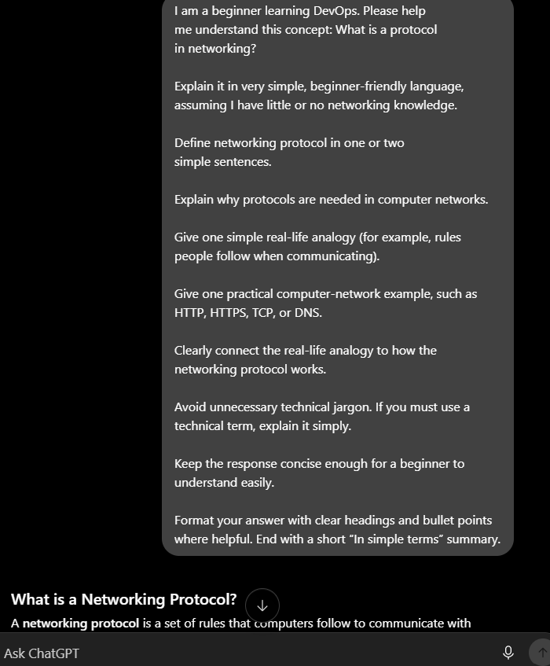
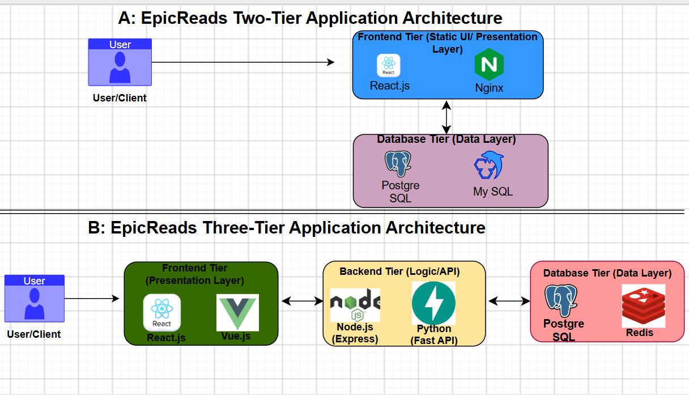
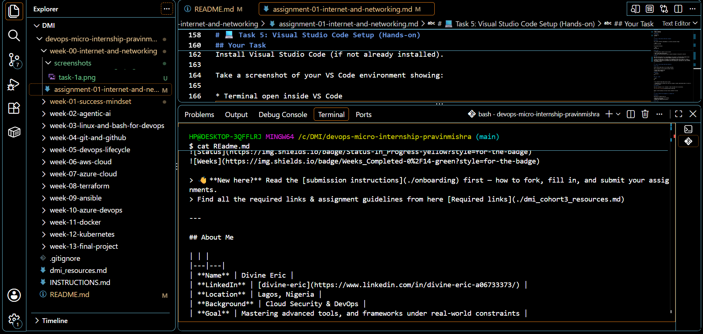

# Week 00 - Internet and Networking

Part of the DevOps Micro Internship (DMI) with Agentic AI

---

# 🧑‍💻 Task 1: Using ChatGPT as Your Learning Assistant

## Scenario

You're new to DevOps and will frequently encounter technical questions. ChatGPT can be your learning companion.

## Your Task

Write a clear ChatGPT prompt to help you understand:

> "What is a protocol in networking? Explain with a simple real-life example."

Take a screenshot of your interaction showing:

* Your detailed prompt (with clear expectations)
* ChatGPT's simplified response with an example

## Screenshot

Save your screenshot in the `screenshots` folder and update the file name below.




Replace `task-1-chatgpt.png` with your actual screenshot file name.

---

## What I Learned (2–3 lines)

I learned that a networking protocol is a set of rules that computers use to communicate with each other.
Protocols like HTTP help devices understand how to send, receive, and respond to information over a network.

---

# 🌐 Task 2: Internet and Networking

## Scenario

Your friend is launching an online bookstore named **EpicReads**.

He asked you to explain how users globally can access his website hosted in Finland.

## Your Task

Write a short explanation (**100–150 words**) that includes:

* Packet Switching
* IP Address
* TCP/IP
* HTTP/HTTPS

💡 **Tip:** You may use ChatGPT (as demonstrated in Task 1) to refine your explanation.

## Answer

Users around the world can access EpicReads, even though the website is hosted in Finland because the Internet connects networks globally. When a user visits the website, the data is broken into small pieces called packets. Packet-switching allows these packets to travel through different networks and routes before reaching the server in Finland.

The user's device has an IP address, which acts like a digital address that helps identify where data should be sent and where responses should return. TCP/IP is a set of communication rules that helps devices send data reliably across the Internet. TCP helps ensure packets arrive correctly, while IP handles addressing and routing.

Finally, HTTP/HTTPS allows the user's browser to communicate with the EpicReads web server and request webpages. HTTPS also encrypts the communication, helping protect information from being read by others.

In simple terms: Your device uses IP to find EpicReads, TCP/IP to move the data, packet switching to deliver it, and HTTP/HTTPS to communicate with the website.

---

# 🏗️ Task 3: Application Architecture & Stack

## Scenario

EpicReads bookstore has two application versions:

### Two-Tier Application

* Frontend
* Database

### Three-Tier Application

* Frontend
* Backend
* Database

## Your Task

* Draw simple diagrams (hand-drawn or tool-based such as draw.io)
* Label each layer clearly
* List at least two common technologies or tools used for each layer
* Submit a screenshot or photo clearly showing your own drawing

## Diagram Screenshot / Photo

Save your diagram image in the `screenshots` folder and update the file name below.




Replace `task-3-diagram.png` with your actual diagram file name.

---

## Technologies Used

### Frontend

* React.js
* Nginx

### Backend

* Node.js (Express)
* Python (Fast API)

### Database

* Postgre SQL
* My SQL

---

# 🌍 Task 4: Domain Name & DNS (Basic Concepts)

## Scenario

Your friend's bookstore **EpicReads** is currently accessible through:

```text
52.172.142.222:3000
```

He purchased the domain:

```text
epicreads.com
```

## Your Task

In **50–100 words**, explain in your own words:

1. What is DNS (Domain Name System)?
2. Which DNS record type should be used to connect the domain to the given IP, and why?

## Answer

DNS (Domain Name System) acts as the phonebook of the internet, translating human-readable domain names like `epicreads.com` into machine-readable IP addresses like `52.172.142.222`. 

To connect `epicreads.com` to the server, an **A (Address) Record** must be used. An A record directly maps an apex domain or subdomain to an IPv4 address. Since `52.172.142.222` is a standard IPv4 address, creating an A record ensures web traffic pointing to `epicreads.com` routes correctly to the backend server.

---

# 💻 Task 5: Visual Studio Code Setup (Hands-on)

## Your Task

Install Visual Studio Code (if not already installed).

Take a screenshot of your VS Code environment showing:

* Terminal open inside VS Code
* Running a basic command:

### Windows

```powershell
dir
```

### Linux / macOS

```bash
pwd
ls
```

* Your selected VS Code theme clearly visible

⚠️ **Important:** The screenshot must show your username or another identifiable detail to confirm it is your environment.

## Screenshot

Save your screenshot in the `screenshots` folder and update the file name below.




Replace `task-5-vscode.png` with your actual screenshot file name.

---

# 🔗 Task 6: Publish Your Assignment as a LinkedIn Post

## Objective

Publishing on LinkedIn helps you:

* Build your professional online presence
* Reinforce your learning
* Document your DevOps journey publicly

## Your Task

Summarize your answers from Tasks 1–5 into a LinkedIn post.

Clearly structure your post into the following sections:

* ChatGPT
* Internet & Networking
* App Architecture
* DNS
* VS Code Setup

Use the credit note that matches your track:

Add the following credit note at the end of your post **(If you are DMI Cohort 3 student)**:

> **P.S. This post is part of the DevOps Micro Internship (DMI) with Agentic AI — Cohort 3 — by Pravin Mishra. My graded progress is public: https://dmi.pravinmishra.com/s/YOUR-GITHUB-USERNAME.html · Start your DevOps journey: https://dmi.pravinmishra.com/?utm_source=student&utm_medium=ps-linkedin&utm_campaign=cohort3**

**Tag [Pravin Mishra](https://www.linkedin.com/in/pravin-mishra-aws-trainer/) in your LinkedIn post, then tag Lead Co-Mentor — [Anjana Muthunayake](https://www.linkedin.com/in/anjana-muthunayake/).**

Add the following credit note at the end of your post **(If you are DMI Self-paced track student)**:

> **P.S. This post is part of the DevOps Micro Internship (DMI) — Self-Paced Engineer Track — by Pravin Mishra. My graded progress is public: https://dmi.pravinmishra.com/s/YOUR-GITHUB-USERNAME.html · Start your DevOps journey: https://dmi.pravinmishra.com/?utm_source=student&utm_medium=ps-linkedin&utm_campaign=self-paced**

Add the following credit note at the end of your post **(If you are DMI Campus student)**:

> **P.S. This post is part of the DevOps Micro Internship (DMI) — Campus — by Pravin Mishra. My graded progress is public: https://dmi.pravinmishra.com/s/YOUR-GITHUB-USERNAME.html · Start your DevOps journey: https://dmi.pravinmishra.com/?utm_source=student&utm_medium=ps-linkedin&utm_campaign=campus**

**Tag [Pravin Mishra](https://www.linkedin.com/in/pravin-mishra-aws-trainer/) in your LinkedIn post, then tag Lead Co-Mentor — [Anjana Muthunayake](https://www.linkedin.com/in/anjana-muthunayake/).**

Hashtags:

#DMIByPravinMishra #AgenticAI #DevOps

Replace `YOUR-GITHUB-USERNAME` with your GitHub username — that link is your public DMI progress page (your graded badge page).
---

## LinkedIn Post URL

Paste your LinkedIn post URL here:

```text
https://lnkd.in/p/efgsy9AA
```

---

## LinkedIn Post Backup Copy

Paste the full text of your LinkedIn post here:

Building a reliable system requires a firm grip on the basics. Here is a direct breakdown of the core concepts I worked through this week across networking, architecture, and developer environment setups:

ChatGPT as an Assistant Leveraging AI effectively comes down to prompt precision. I used structured prompting to break down complex networking concepts specifically asking for non-technical, real-world analogies to demystify protocol handshakes without losing technical accuracy.

Internet & Networking To understand how a user globally accesses a site like "EpicReads" hosted on a remote server in Finland:

▪️HTTP/HTTPS handles the application-layer request.

▪️TCP/IP breaks that request into manageable data chunks and guarantees reliable delivery.

▪️IP Addresses define the precise source and destination endpoints.

▪️Packet Switching breaks the data into independent packets, routing them dynamically across global routers before reassembling them seamlessly at the host server.

App Architecture I mapped out two deployment models for the bookstore using Draw. io:

🔸Two-Tier: Direct coupling between the Presentation Layer (React.js / Nginx) and the Data Layer (PostgreSQL / MySQL).

🔸Three-Tier: Introducing an isolated Business Logic Layer (Node.js / Python FastAPI) between Frontend and Database. Separating concerns prevents database exposure and allows independent scaling of API logic.

DNS To point 𝒆𝒑𝒊𝒄𝒓𝒆𝒂𝒅𝒔 away from an raw IP string like 52.172.142.222

🔹DNS acts as the internet's mapping directory, translating human-readable domain names into IP addresses.

🔹An A (Address) Record is required here because it explicitly maps the naked root domain (epicreads.com) directly to an IPv4 address.

VS Code Setup Configured my local development environment using Visual Studio Code with custom key-bindings, integrated terminal workflows, and active directory checks to keep project files organized right from the shell.

Pravin Mishra
Anjana Muthunayake

P.S. This post is part of the DevOps Micro Internship (DMI) — Foundation Track — by Pravin Mishra. My graded progress is public: https://lnkd.in/e9vDPbhA · Start your DevOps journey: https://lnkd.in/eYRTeqwU

#DMIByPravinMishra #AgenticAI #DevOps

---

# Reflection – Week 0

### What did you find easy?

I found most of the things easy because I have a prior knowledge 

---

### What was difficult?

With the activities I didn't find anything difficult

---

### What will you improve next week?

Time management to be effective in my works 

---

## 📌 About DMI & CloudAdvisory

DevOps Micro Internship (DMI) is a project-based DevOps program run by Pravin Mishra (The CloudAdvisory) focused on real-world execution, systems thinking, and career readiness.

It helps learners build strong DevOps foundations with hands-on experience.


## 📌 Resources

- 🌐 **DMI Official Website:** https://dmi.pravinmishra.com?utm_source=github&utm_medium=readme  
- 🎓 **University:** https://university.pravinmishra.com?utm_source=github&utm_medium=readme  
- 💬 **Discord Community:** https://discord.pravinmishra.com?utm_source=github&utm_medium=readme  
- 📝 **Blog:** https://dmi.pravinmishra.com/blog?utm_source=github&utm_medium=readme  
- ▶️ **YouTube Playlist (DMI Cohort 3):** https://www.youtube.com/playlist?list=PLFeSNDtI4Cho  
- 🔗 **Pravin Mishra (LinkedIn):** https://www.linkedin.com/in/pravin-mishra-aws-trainer/  
- 🏢 **CloudAdvisory (LinkedIn):** https://www.linkedin.com/company/thecloudadvisory/

---

*This submission is part of DevOps Micro Internship (DMI) — Agentic AI Track*